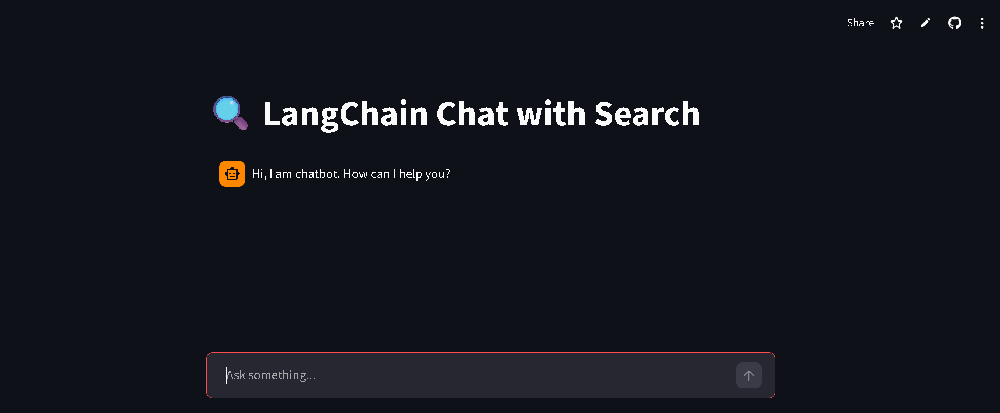

# 🔍 LangChain Chat with Search (Agent-Based Chatbot)

🚀 **Live Demo:**
👉 [https://your-streamlit-app-link](https://search-engine-using-tools-and-agent-with-llm-llvqkm3np6fgmixuq.streamlit.app/)

---

## 📌 Overview

This project is an **AI-powered Search Agent Chatbot** built using LangChain and Groq.
It can intelligently answer user queries by dynamically using multiple tools such as:

* 🌐 Web Search (DuckDuckGo)
* 📚 Wikipedia
* 📄 Arxiv (Research Papers)

Unlike traditional chatbots, this system uses an **Agent-based architecture**, allowing the LLM to decide which tool to use for better answers.

---

## ✨ Features

* 💬 ChatGPT-style conversational UI
* 🧠 Intelligent tool selection using LangChain Agents
* 🌐 Real-time web search integration
* 📚 Wikipedia-based answers
* 📄 Arxiv research paper search (with rate-limit handling)
* ⚡ Fast responses using Groq LLM (LLaMA 3.3 70B)
* ☁️ Deployed on Streamlit Cloud

---

## 🏗️ Tech Stack

* **Frontend:** Streamlit
* **LLM:** Groq (LLaMA 3.3 70B)
* **Framework:** LangChain
* **Tools:**

  * DuckDuckGo Search
  * Wikipedia API
  * Arxiv API

---

## ⚙️ How It Works

1. User enters a query
2. LangChain Agent analyzes the question
3. Decides which tool to use:

   * Wikipedia → for definitions
   * Search → for latest info
   * Arxiv → for research papers
4. Retrieves information
5. LLM generates final response

---

## 🛠️ Installation (Local Setup)

### 1️⃣ Clone the repository

```bash
git clone https://github.com/your-username/your-repo-name.git
cd your-repo-name
```

### 2️⃣ Create Conda environment

```bash
conda create -n search_agent_env python=3.10
conda activate search_agent_env
```

### 3️⃣ Install dependencies

```bash
pip install -r requirements.txt
```

---

## 🔐 Environment Variables

Create a `.env` file (for local use):

```env
GROQ_API_KEY=your_api_key_here
```

---

## ▶️ Run the App

```bash
streamlit run app.py
```

---

## ☁️ Deployment (Streamlit Cloud)

1. Push code to GitHub
2. Go to Streamlit Cloud
3. Deploy your app
4. Add secret:

```toml
GROQ_API_KEY="your_key_here"
```

---

## 📸 Screenshot



---

## 📚 Key Learnings

* Built Agent-based AI system using LangChain
* Integrated multiple external tools dynamically
* Handled API rate limits (Arxiv 429 error)
* Deployed real-world AI application

---

## 🔮 Future Improvements

* 💬 Add memory-aware agent
* 🔗 Combine with RAG (PDF chatbot)
* 📊 Add more tools (news, finance APIs)
* 🎨 Improve UI/UX

---

## 🤝 Contributing

Contributions are welcome! Feel free to fork and improve.

---

## ⭐ Support

If you like this project, please ⭐ the repository!

---
